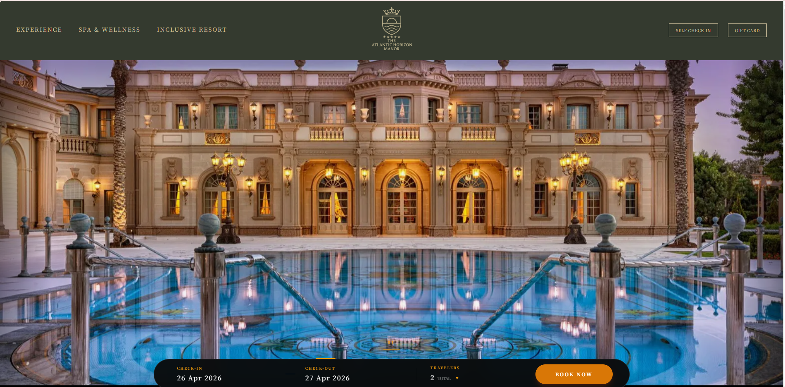

# Atlantic Horizon Manor - Management Portal


A luxury hotel management system built with the **MERN Stack** (MongoDB, Express, React, Node.js). This portal allows administrators to manage bookings, gift cards, and monitor system security.

## Features
- **Booking Management**: Real-time tracking and confirmation of hotel reservations.
- **Giftcard Center**: Manage and issue digital gift cards with status tracking.
- **Security Audit Logs (Boss Only)**: A dedicated monitoring system to track admin login activities, capturing IP addresses and timestamps.
- **RBAC (Role-Based Access Control)**: Tiered access levels for Staff, Managers, and the Boss.

## Tech Stack
- **Frontend**: React.js, Tailwind CSS, Framer Motion (for animations).
- **Backend**: Node.js, Express.js.
- **Database**: MongoDB Atlas.
- **Security**: JWT (JSON Web Tokens), Bcrypt encryption.

## Installation & Setup

1. **Clone the repository**:
   ```bash
   git clone https://github.com/DerrickLongkai/Atlantic_Horizon_Manor_Hotel.git
    ```

2. **Backend Setup**:

Navigate to /backend.

Run npm install.

Create a .env file with MONGO_URI, JWT_SECRET, and PORT=8888.

Start server: node server.js.

3. **Frontend Setup**:

Navigate to /frontend.

Run npm install.

Create a .env file with REACT_APP_API_URL=http://localhost:8888/api.

Start app: npm start.


